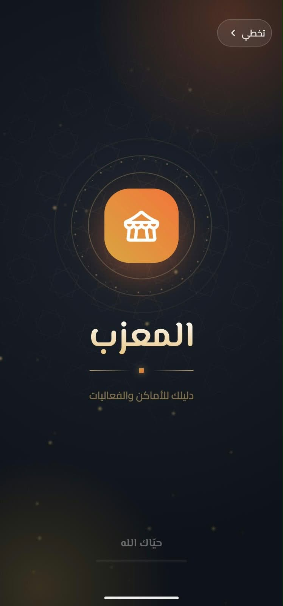
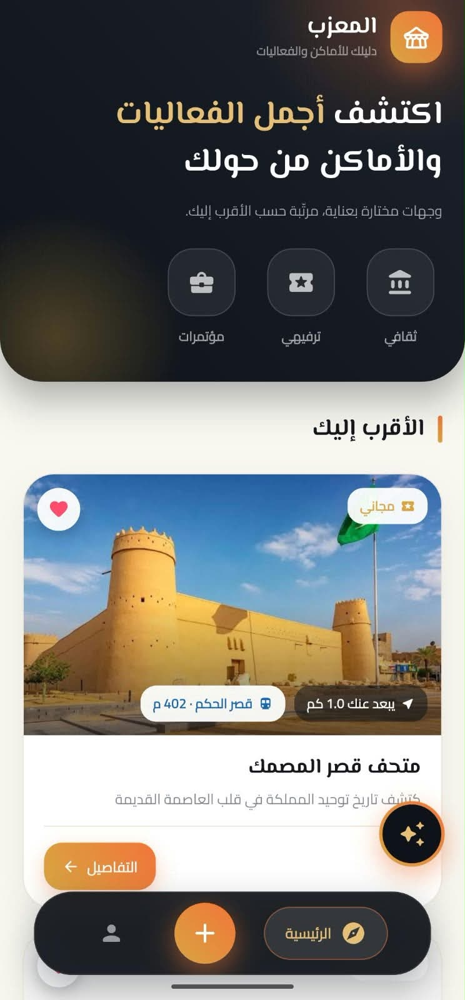
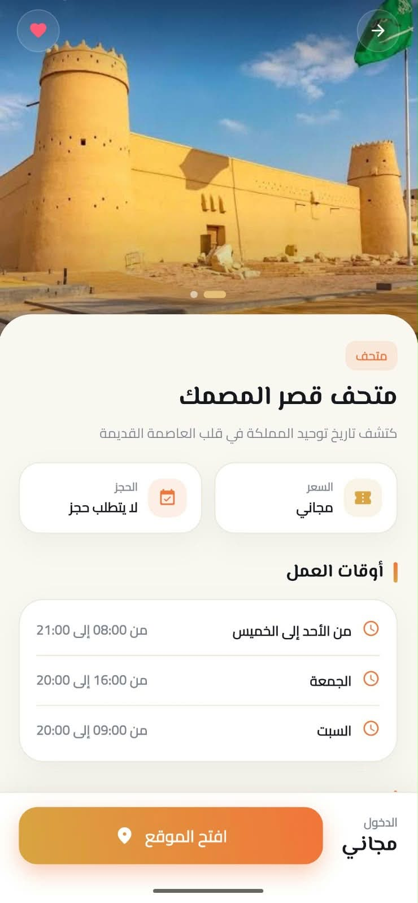
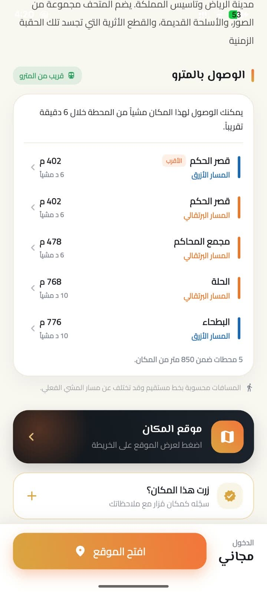
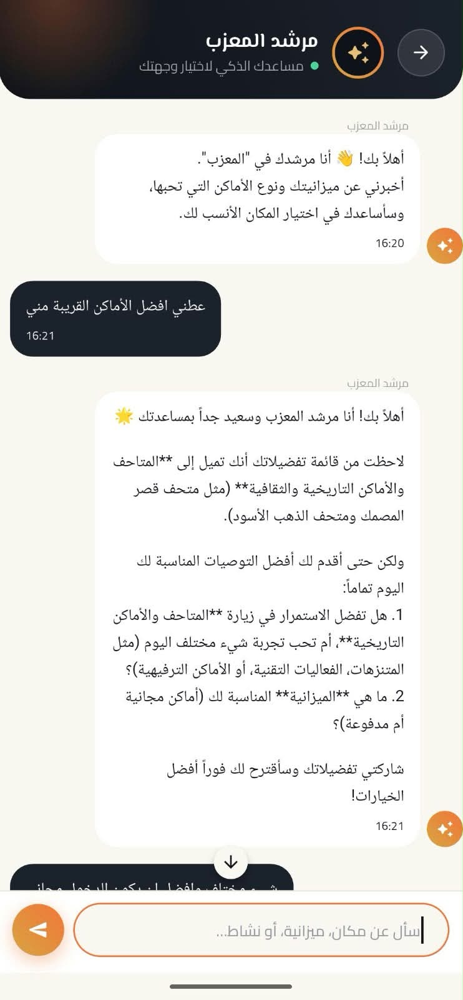
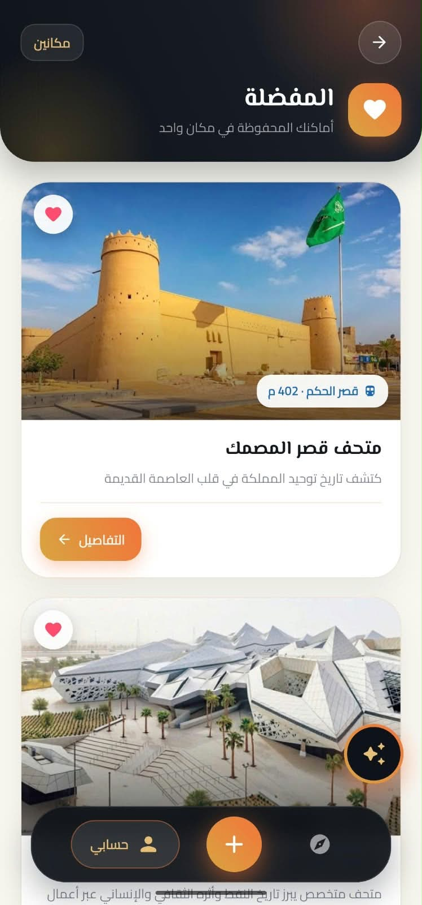
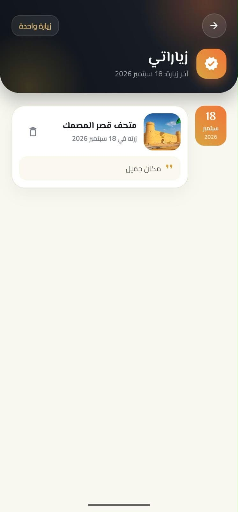
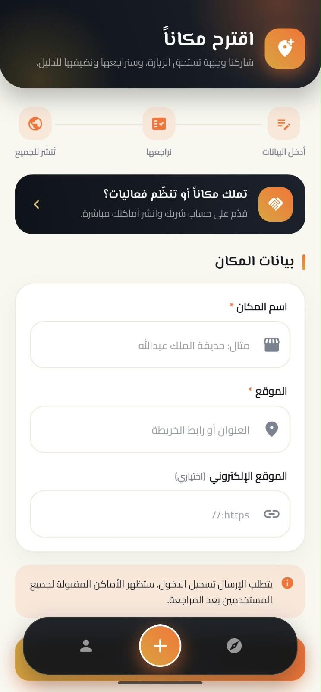
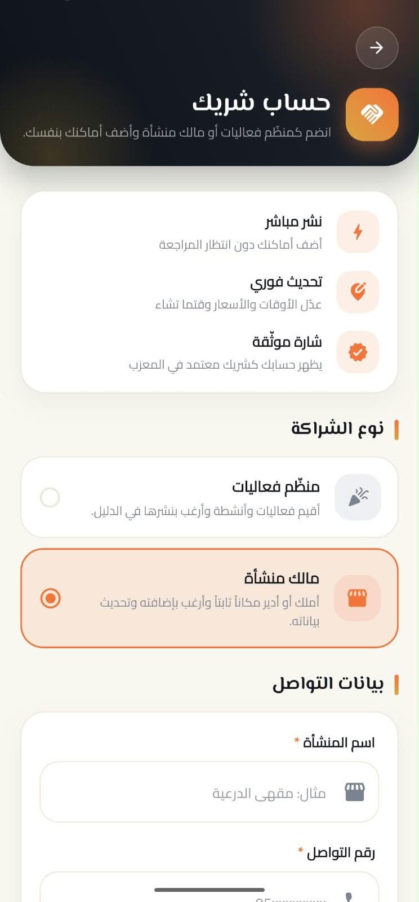
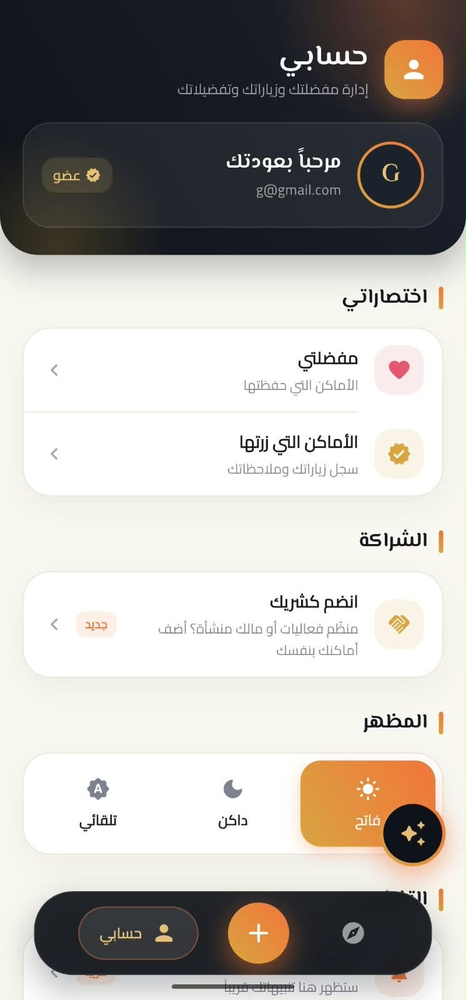

[saلقراء النسخة العربية ](README-ar.md)
<div align="center">


# 🏛️ Al-Muazzab (المعزب)

### Your Smart Guide to Places & Events

A mobile app that helps you discover the best nearby places and events in Riyadh — cultural, entertainment, and conferences — with an AI assistant that plans your trip for you.

[](https://flutter.dev)
[](https://dart.dev)
[](https://supabase.com)
[](https://ai.google.dev)

</div>

---

## 📋 Table of Contents

- [About the Project](#-about-the-project)
- [Screenshots](#-screenshots)
- [Features](#-features)
- [Tech Stack](#️-tech-stack)
- [Database](#️-database)
- [AI Assistant](#-ai-assistant--murshid-al-muazzab)
- [Requirements](#-requirements)
- [Installation & Setup](#-installation--setup)
- [App Walkthrough](#-app-walkthrough)
- [Project Structure](#-project-structure)
- [Roadmap](#-roadmap)
- [Team](#-team)
- [License](#-license)

---

## 📖 About the Project

**Al-Muazzab** is a Flutter app that acts as a smart guide to places and events in Riyadh. The app uses the **user's live location** to automatically rank places and events from nearest to farthest — no category selection required — and surfaces practical details like proximity to metro stations, pricing, and working hours, along with an AI assistant that recommends your next destination based on your budget and interests.

This project is the **final graduation project** for the Flutter Development Bootcamp — Tuwaiq Academy.

---

## 📸 App Screenshots

| Splash Screen | Home Screen | Place Details |
|:---:|:---:|:---:|
|  |  |   |

| AI Guide | Favorites | Saved |
|:---:|:---:|:---:|
|  |  |  |

| Suggest a Place | Partner Account | Profile |
|:---:|:---:|:---:|
|  |  |  |
---

## ✨ Features

### 🧭 Smart, Location-Based Discovery
- Nearby places and events are shown automatically as soon as the app opens — no category needs to be picked — based on the user's coordinates and each place's coordinates.
- Quick category filters at the top of the home screen (Cultural, Entertainment, Conferences...), with results within each category ranked from nearest to farthest.
- Each card shows key info at a glance: place name, free/paid, distance from you, and the nearest metro station.

### 📍 Rich Place Details
- Photo gallery, simplified description, and secondary category (e.g., museum).
- Does it require a reservation? What's the price? What are the working hours for each day of the week?
- A dedicated metro section listing the nearest stations, with line name, distance, and estimated walking time for each.
- A direct link to the location on the map, and a ticket-booking link when available.

### ❤️ Personal Interaction
- **Favorites**: save places you like to revisit later.
- **My Visits ("Mazar")**: log places you've actually visited, with a personal note and visit date (Today / Yesterday / custom date).

### 🤖 Murshid Al-Muazzab — AI Assistant (Gemini AI)
- An interactive chatbot that asks about your budget, interests, and preferred type of places.
- Suggests suitable destinations and helps you plan your visit schedule.

### 🏪 Place Suggestions & Partner Accounts
- **Suggest a Place**: any registered user can suggest a new place (name, location, website) to be reviewed and published for everyone.
- **Partner Account**: an onboarding system for business owners and event organizers, allowing them (in the future) to publish and update their own places directly without waiting for review, with a "Verified" badge on their account. Two partnership types:
  - **Event Organizer**: hosts events/activities and publishes them in the directory.
  - **Business Owner**: owns or manages a fixed venue and wants to add/update its details.

### 🔐 Accounts & Settings
- Sign-in and user verification via Supabase Auth.
- Theme switching (Light / Dark / System).
- Sign out, plus quick access to Favorites and Visits from the profile page.

---

## 🛠️ Tech Stack

| Category | Technology |
|---|---|
| **Framework** | Flutter |
| **Language** | Dart |
| **Database** | Supabase (PostgreSQL) |
| **Authentication** | Supabase Authentication |
| **AI** | Google Gemini AI |
| **Location** | Geolocation for distance calculations and nearest metro stations |

---

## 🗄️ Database

The database runs on **Supabase (PostgreSQL)** and is built mainly around two tables linked by a **Foreign Key**:

1. **Places / Events table** — contains all the required columns for each place or event: name, description, images, location/coordinates, price, reservation info, working hours, booking link, etc.
2. **Categories table** — used for sorting and filtering (e.g., Cultural, Entertainment, Conferences), linked to the places table via a foreign key.

> Database migration files are in the [`supabase/migrations`](./supabase/migrations) folder.

---

## 🤖 AI Assistant — Murshid Al-Muazzab

**"Murshid Al-Muazzab"** ("The Host's Guide") is a chatbot powered by **Gemini AI** that asks the user about their budget and preferred type of places, then:
- Analyzes their preferences from the Q&A.
- Suggests the best-fitting destinations.
- Helps plan a visit schedule.

---

## ✅ Requirements

Before running the project, make sure you have:

- [Flutter SDK](https://docs.flutter.dev/get-started/install) (latest stable)
- [Dart SDK](https://dart.dev/get-dart) (bundled with Flutter)
- A [Supabase](https://supabase.com) account/project (Project URL + Anon Key)
- A [Google Gemini](https://ai.google.dev/) API key
- An Android/iOS emulator or a physical device

---

## 🚀 Installation & Setup

```bash
# 1. Clone the repository
git clone https://github.com/final-prjoect-tuwaiq-flutter/project_flutter.git
cd project_flutter

# 2. Install dependencies
flutter pub get
```

### Environment Variables

Create a `.env` file in the project root with your own credentials:

```env
SUPABASE_URL=your_supabase_project_url
SUPABASE_ANON_KEY=your_supabase_anon_key
GEMINI_API_KEY=your_gemini_api_key
```

> ⚠️ Never commit these keys to a public repo — make sure `.env` is listed in `.gitignore`.

### Database Setup

1. Create a new Supabase project.
2. Apply the migration files in `supabase/migrations` to your database (via Supabase CLI or the dashboard).
3. Enable the Authentication service from the Supabase dashboard.

### Run the App

```bash
flutter run
```

---

## 📱 App Walkthrough

1. **Splash Screen** — welcome screen with the "Al-Muazzab" logo and name.
2. **Home Screen** — automatically shows nearby places and events, with quick category filters (Cultural, Entertainment, Conferences) and distance-based ranking.
3. **Details Page** — everything you need to know about a place or event: photos, description, category, price, reservation info, working hours, nearest metro stations, and location/booking links.
4. **Murshid Al-Muazzab (Chatbot)** — AI assistant that asks about your preferences and suggests/plans places for you.
5. **Suggest a Place** — a form to submit a new place, reviewed before being published to everyone.
6. **Partner Account** — onboarding form as an Event Organizer or Business Owner.
7. **Profile** — manage Favorites, Visits ("Mazar"), the partner sign-up, and appearance (Light/Dark/System).

---

## 📂 Project Structure

```
project_flutter/
├── android/                # Android platform config
├── ios/                    # iOS platform config
├── web/                    # Web build config
├── lib/                    # Main app code (screens, services, models)
├── supabase/
│   └── migrations/         # Database migration files (tables & relations)
├── test/                   # Tests
├── pubspec.yaml            # Dependencies
└── README.md
```

---

## 🔮 Roadmap

- Enable direct publishing of places from Partner accounts (organizers/owners) without manual review.
- Expand coverage to cities beyond Riyadh.
- Push notifications for new nearby events.

---

## 👥 Team

This project was passionately developed as a graduation project for the Flutter App Development Bootcamp (Tuwaiq Academy).

* **Faisal Alwarthan** – 
* **Mustafa Alashraf** – 

---
<div align="center">
  Made with ❤️ in Riyadh
</div>
---

## 📄 License

This project was developed for educational purposes as part of the Tuwaiq Academy Bootcamp.
